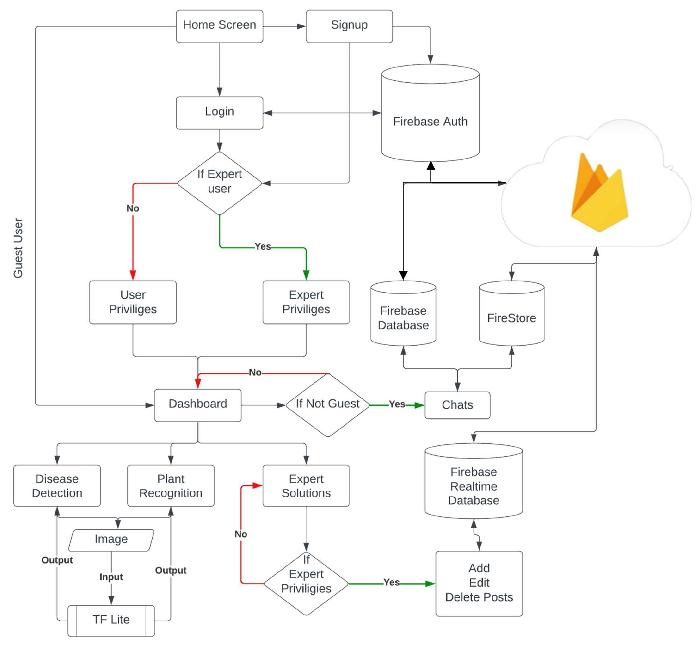
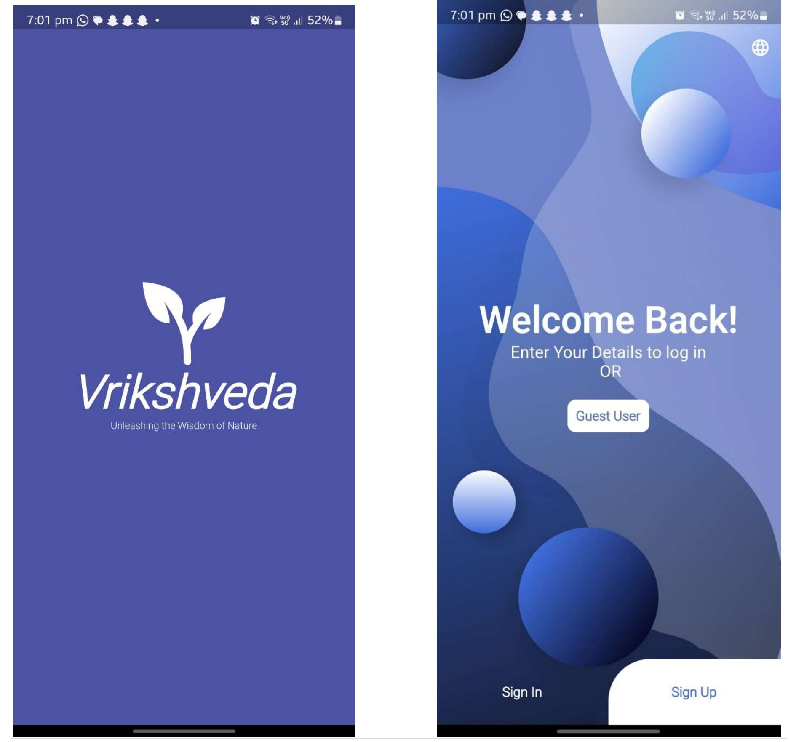
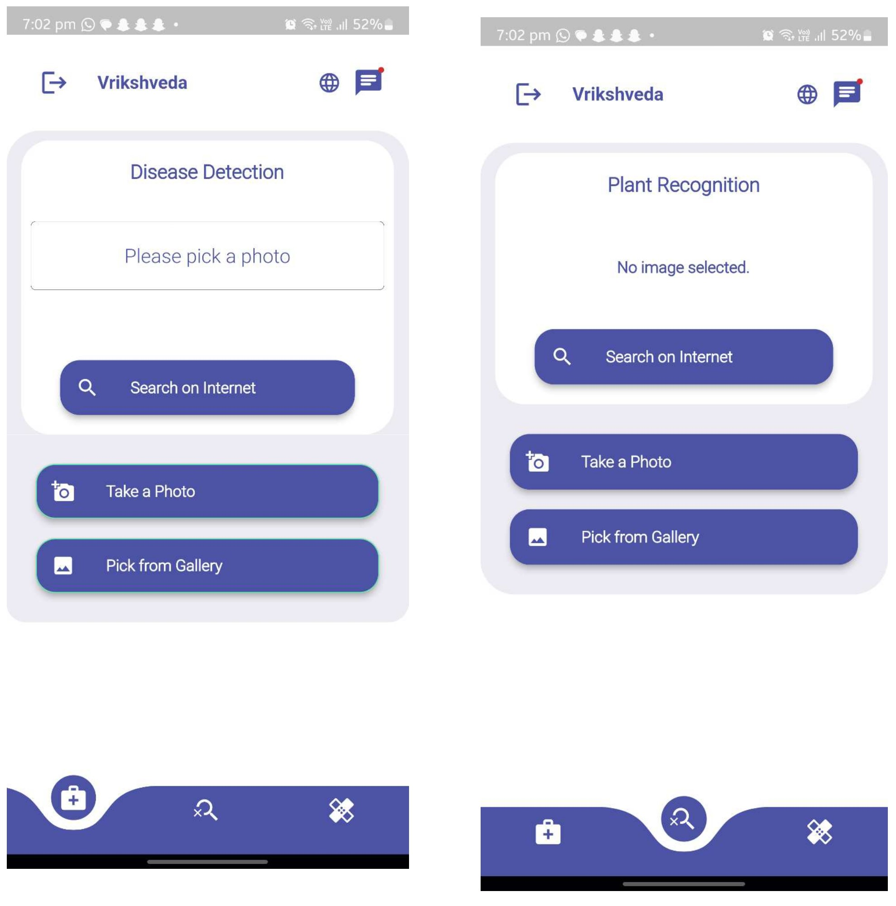
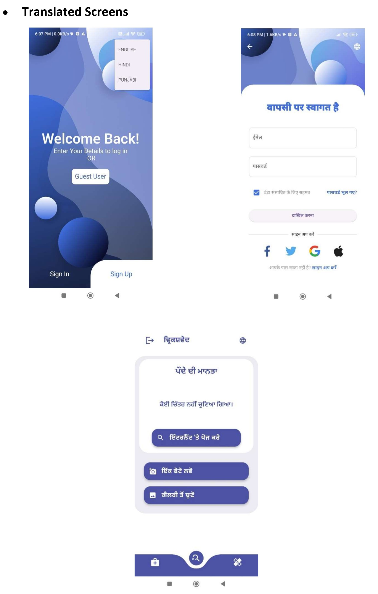

# Vrikshved
Vrikshveda is a mobile application that uses Flutter and TensorFlow to recognize plants and detect diseases. The app is designed to revolutionize agriculture by providing farmers and experts with a convenient tool for monitoring crop health and taking proactive measures to ensure optimal plant growth and yield. The app's frontend is developed using Flutter, a popular open-source mobile application development framework that allows developers to build high-performance, cross-platform apps for iOS and Android. The app's backend is powered by TensorFlow, an open-source machine learning library developed by Google that is widely used for deep learning and artificial intelligence applications. Vrikshveda uses machine learning algorithms to recognize plants and detect diseases based on images captured by the user's smartphone camera. It uses MobileNetV3 trained on plantvillage dataset and https://tfhub.dev/google/aiy/vision/classifier/plants_V1/1 as model. The app's user interface is designed to be intuitive and user-friendly, with features such as a plant recognition tool, a disease detection tool, and a database of plant and disease information. Overall, Vrikshveda is a cutting-edge solution for plant recognition and disease detection that has the potential to revolutionize agriculture by providing farmers and experts with a convenient tool for monitoring crop health and taking proactive measures to ensure optimal plant growth and yield.the project focused on plant recognition and disease detection using the powerful combination of Flutter, TensorFlow, and Firebase aims to redefine the landscape of agricultural technology. By seamlessly integrating machine learning capabilities, cross-platform app development, and cloud-based solutions, the project envisions providing farmers and plant enthusiasts with an innovative tool for efficient crop monitoring and disease management.
The integration of TensorFlow's advanced image classification models within the Flutter framework promises to deliver a user-friendly mobile application. This app will not only identify plants and detect diseases accurately but will also empower users with real-time results, fostering proactive measures to ensure optimal plant health and yield.
Beyond the core functionalities, the project takes a step further by introducing a chat option with experts. This feature allows users to connect with agricultural specialists, seek advice, and receive expert solutions for specific plant-related queries. The addition of a dedicated portal, supported by Firebase, serves as a centralized hub for accessing expert advice, managing user accounts, and facilitating seamless communication between users and experts.
Furthermore, Firebase integration extends to the implementation of secure sign-in and sign-out processes, ensuring a reliable and personalized user experience. The platform leverages Firebase's robust features for user authentication and real-time database management, enhancing the overall security and efficiency of the application.
In essence, this project not only showcases the potential of Flutter and TensorFlow in building intelligent mobile applications but also highlights the transformative impact of Firebase integration. The combination of these technologies not only contributes to advancements in agriculture, botany, and plant health management but also provides a holistic solution that addresses the diverse needs of users in the agricultural domain.

 
 
This code is for version 2.0 , kindly check branch v1.0.0 for older version.
 
 
 
Project Flow Diagram:-
 

 

 

 
Startup Screen:-
 

 

 

 

Sign in and Sign Up Page:-
 

 

 

 
Disease and Plant Recognition :-
 
 

 

 

Chat and Expert Solution :-
 
 

 

 
Translation :-
 
 

 

 